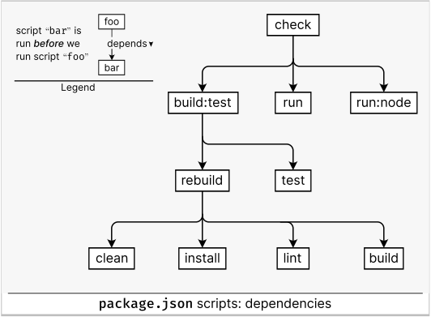

# CONTRIBUTING

The following applies to every package in the workspace, unless its `README.md` says otherwise. The running example used below is the `geometry` package.

## Table of Contents

1. [Configuration](#configuration)
    1. [Typescript](#typescript)
    1. [Vitest](#typescript)
    1. [ESLint and Prettier](#eslint-and-prettier)
    1. [API-Extractor](#api-extractor)
1. [Project Scripts](#project-scripts)
1. [Workspace Scripts](#workspace-scripts)

## Configuration

Every workspace project features a `depends.txt` file at its root where its dependencies are declared. The configuration files `package.son`, `tsconfig.json`, etc. are all generated from this and some other sources of truth:

1. Project directory name - will be the `package.json` _name_
2. Project description from README.md - becomes the `package.json` _description_
3. The workspace root `package.json` is read for git and homepage info

This is explained in [`verify-project.sh`](scripts/verify-project.sh). It is run when one of the truth sources changes in order to regenerate the configuration.

### Typescript

* [`tsconfig.json`](packages/geometry/tsconfig.json) builds ESM with no tests. Project references to dependencies appear here, mirroring the references in `package.json` `dependencies`.

* [`tests/tsconfig.json`](packages/geometry/tests/tsconfig.json) for the benefit of tests

### Vitest

* [`tests/vitest.config.ts`](packages/geometry/tests/vitest.config.ts) uses the Typescript config from [`tsconfig.json`](packages/geometry/tsconfig.json) but adds test globals

### ESLint and Prettier

Lint scripts are configured to use the root project configuration from [`.eslintrc.cjs`](.eslintrc.cjs) and [`.eslintignore`](.eslintignore)

### API-Extractor

The central configuration is at [`config/api-extractor.base.json`](config/api-extractor.base.json). Projects have their own configuration file [`config/api-extractor.shared.json`](config/api-extractor.shared.json). It references the base configuration.

## Project Scripts

|   |Name           |Effect|
|--:|-|-|
| 1.|`clean`        |Clean output dirs|
| 2.|`lint`         |Show lint errors|
| 3.|`lint:fix`     |Fix lint errors|
| 5.|`test`         |Verbose run given tests/all tests and exit|
| 4.|`test:dev`     |Test in dev mode|
| 6.|`test:coverage`|Show test coverage report|
| 7.|`build:compile`|Check with typescript compiler|
| 8.|`build`        |Build project as ESM to `esm/`|
| 9.|`rebuild`      |Clean, install, lint and then `build`|
|10.|`build:test`   |Run all tests after a rebuild|
|11.|`api`          |Run API-Extractor|
|12.|`run`          |Run main project app or demo|
|13.|`run:node`     |Like `run` but from compiled Javascript|
|14.|`check`        |Run tests and all apps/demos after a `rebuild`|

In the diagram below you can see what project scripts are run as dependencies:

<picture>
  <source media="(prefers-color-scheme: light)" srcset="doc/imagesV4/package-script-dependencies-light.svg">
  <source media="(prefers-color-scheme: dark)" srcset="doc/imagesV4/package-script-dependencies-dark.svg">
  
</picture>

## Workspace Scripts

|   |Name              |Effect|
|--:|-|-|
| 1.|`clean`           |Clean all projects|
| 2.|`images`          |Upgrade image names to bust the image cache|
| 3.|`check:project`   |`check` a single project|
| 4.|`doc:project`     |Build docs for a single project|
| 5.|`verify:project`  |Verify named project configuration. Create an empty project dir then run this to configure it|
| 6.|`pack:project`    |Pack a single project|
| 7.|`check`           |`check:project` on all projects|
| 8.|`verify`          |`verify:project` on all projects|
| 9.|`pack`            |`pack:project` on all projects|

