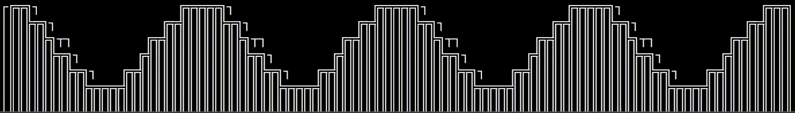
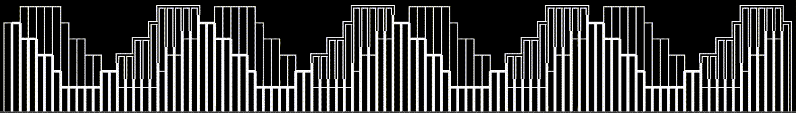
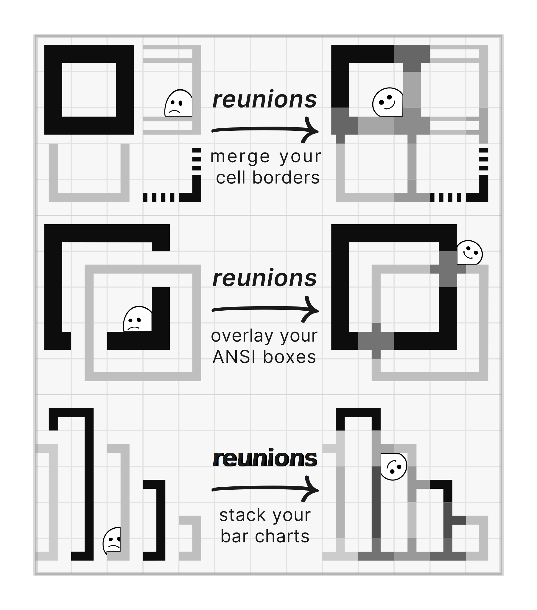
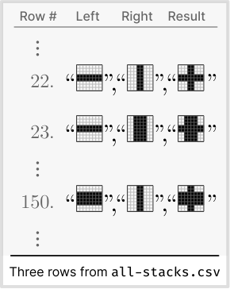
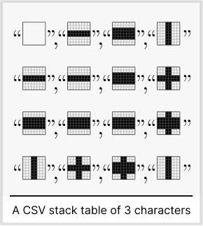

<h1 align="center">reunions-data</h1>

<picture>
  <source media="(prefers-color-scheme: light)" srcset="../../doc/imagesV3/reunions-logo-light.svg">
  <source media="(prefers-color-scheme: dark)" srcset="../../doc/imagesV3/reunions-logo-dark.svg">
  
</picture>

Precomputed metadata for Unicode pseudographic characters


## Table of Contents

1. [Overview](#overview)
    * [Why?](#why)
1. [Usage](#usage)
    1. [Stacking](#stacking)
1. [The Files](#the-files)
    1. [all-stacks.csv](#all-stackscsv)
    1. [all-stacks-unquoted.csv](#all-stacks-unquoted.csv)
        1. [Using all-stacks-unquoted.csv](#usage)
    1. [stack-table.csv](#stack-tablecsv)
1. [See Also](#the-files)
1. [Project Development](#project-development)

<br/>

<details open>
<summary>&nbsp;Before and After</summary>
<table>
  <tbody>
    <tr>
      <td align="center"><i>Before</i></td><td align="center"><i>After</i></td>
    </tr>
    <tr>
      <td>

      </td>
      <td>

      </td>
    </tr>
  </tbody>
</table>
</details>

<br/>

## Overview

Here you will find several data files and the code that generates them. The files describe, in various forms, all possible stackings among the characters in the Unicode ranges [Box Drawing](https://www.unicode.org/charts/PDF/U2500.pdf) and [Block Elements](https://www.unicode.org/charts/PDF/U2580.pdf), mappings between the drawing character pairs and the best corner that connects them, mapping of relations between them, and more. The goal is to make it easier to work with these drawing characters.

1. [all-stacks.csv](#all-stackscsv) `146K` file: [` 🗀 all-stacks.csv`](all-stacks.csv)
1. [all-stacks-unquoted.csv](#all-stacks-unquotedcsv) `97K` file: [` 🗀 all-stacks-unquoted.csv`](all-stacks-unquoted.csv)
1. [stack-table.csv](#stack-tablecsv) `155K` file: [` 🗀 stack-table.csv`](stack-table.csv)

<picture style="margin-left: 2ch">
  <source media="(prefers-color-scheme: light)" srcset="doc/imagesV3/reunions-why-light.svg">
  <source media="(prefers-color-scheme: dark)" srcset="doc/imagesV3/reunions-why-dark.svg">
  
</picture>


### Why?

Terminals display a grid of cells. Each can hold a single character. When we write a character to a cell the existing character is immediately destroyed and the new character is displayed.

But the _non-destructive_ stacking of visuals on top of one another is fundamental to all visual work, from Neanderthal hand stencils to CSS3 filters.

[Terminal pseudographics](https://en.wikipedia.org/wiki/Semigraphics) are an extreme visual form thanks to the ultra low resolution, yet such non-destructive composition is highly non-trivial.

Eventually someone (me) got tired of hacking around this tiny annoyance and decided to build this temporary fix. It is temporary because, as everybody knows, we will soon be replacing our clunky Disco-era terminals with the science fiction UIs of the future.

As long we as are still using terminals, we could improve the APIs a bit. For example, make them more _composable_ by making it easy to place a glyph in any terminal cell _without_ destroying existing content.

You need at least a pair of characters if you want to be stacking anything. To help in _finding_ the glyphs you want to stack, a few other mappings are included. They support these use cases:

* *Navigating glyphs by property* - for example find the 90ᵒ degree rotation of the thin horizontal center line: `“─” ↻ “│”` 

* *Finding all possible elbows that connect _four_ glyphs* - for example find the possible elbows for the lines `{↑: “═”, →: “║”, ↓: “═”, ←: “║”]`. The result in this case would be a single 4-tuple of characters: `[↖: “╔”, ↗: “╗”, ↙: “╚”, ↘: “╝”]`.

* *Classify a character* - for example: is it a horizontal line? A character with a double-line glyph? 

* *Listing all border set character groups* - for example get the 8 characters that make up the border set group for a border of thin horizontal lines and double vertical lines: `[“╓”, “─”, “╖”, “║”, “╜”, “─”, “╙”, “║”]`

* *Navigating between the borders sets* - by property similarity, just like glyph navigation. For example getting the thin line border, and navigating to the _thick_ line border by adding _weight_.


<br clear="all"/>

## Usage

### Stacking

If you need to find the stacking of two characters, search for the row that includes them both. The `all-stacks-unquoted.csv` is probably best for this. For example in a `bash` function:

```bash
> function on_top {  grep -P "($1,$2)|($2,$1)" all-stacks-unquoted.csv }
```

And then use it to stack characters so:

```bash
> # ↓ lets try stacking
> on_top ─ ┃


─,┃,╂

> # ↓ but no output when no stack: no character for an “a” on top of a “b”
> on_top a b

```

## The Files

### [all-stacks.csv](all-stacks.csv)

<a id="three-rows-img"></a>

<picture>
  <source media="(prefers-color-scheme: light)" srcset="doc/imagesV3/three-rows-from-all-stacks-light.svg">
  <source media="(prefers-color-scheme: dark)" srcset="doc/imagesV3/three-rows-from-all-stacks-dark.svg">
  
</picture>

A row describes a possible stacking: a triplet of two input characters and a result, in three columns:

1. _left_ - first character being stacked
1. _right_ - second character being stacked
1. _result_ - stack result character

Some of the stackings for horizontal and vertical lines, for example, will be found at rows `22`, `23` and `150`, as shown in the example table [to the right](#three-rows-img). The file describes `8,177` such triplets.

<p></p>

### [all-stacks-unquoted.csv](all-stacks-unquoted.csv)

Is exactly like [all-stacks](#all-stackscsv), but skips the character quoting.

<br clear="all"/>

### [stack-table.csv](stack-table.csv)

<a id="stack-table-img"></a>

<picture>
  <source media="(prefers-color-scheme: light)" srcset="doc/imagesV3/stack-table-of-3-characters-light.svg">
  <source media="(prefers-color-scheme: dark)" srcset="doc/imagesV3/stack-table-of-3-characters-dark.svg">
  
</picture>

This is the cartesian product of all characters with themselves, showing at each cell the stacking of the characters in the cell's row & column headers, much like a _multiplication table_. Like a multiplication table, it is also symmetric on the diagonal.

If we were stacking only three characters, the table would look like the example [to the right](#stack-table-img). The real table stacks `173` characters vs. themselves, and is composed of `29,929` cells, of which `16,620` are non-empty (`56%`).

The table is made up of _four_ parts:

1. _Top-left corner_ cell is empty
1. _First row_ features the column headers. All characters below a column header are the result of stacking it with some other character, except on the diagonal where you see it stacking with itself
1. _First column_ shows the row headers. All characters right of a row header are the result of the stacking it with some other character, except of course on the diagonal
1. _Table body_ is filled with the stackings of the characters in the row & column headers. Stackings which are impossible because the stacking of the headers creates a shape which looks like no Unicode character, are given as a single space character. For example the stacking of `“ ▀ ”` and `“ │ ”` will appear as a quoted space character (`“  ”`), because no Unicode character matches their stacking.

## Plan

- [x] stack 
- [x] border sets
- [x] elbows
- [x] relations
- [ ] classification
- [ ] border set relations


## See Also

* Unicode [Box Drawing](https://www.unicode.org/charts/PDF/U2500.pdf) range
* Unicode [Block Elements](https://www.unicode.org/charts/PDF/U2580.pdf) range
* [reunions](../reunions/README.md) - the Typescript library that computes these things
* The “[joining-borders](https://github.com/jtdaugherty/brick/blob/master/docs/guide.rst#joining-borders)” feature of the Haskell [brick](https://hackage.haskell.org/package/brick) library

## Project Development

See [workspace CONTRIBUTING](../../CONTRIBUTING.md)
