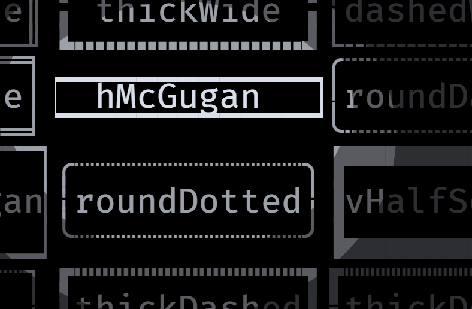

<h1 align="center">reunions-data</h1>

<picture>
  <source media="(prefers-color-scheme: light)" srcset="../../doc/imagesV4/reunions-logo-light.svg">
  <source media="(prefers-color-scheme: dark)" srcset="../../doc/imagesV4/reunions-logo-dark.svg">
  
</picture>

Precomputed metadata for Unicode pseudographic characters


## Table of Contents

1. [Overview](#overview)
1. [Usage](#usage)
    1. [Stacking](#stacking)
    1. [Finding Border Characters](#stacking)
1. [The Files](#the-files)
    1. Stacking
        1. [all-stacks.csv](#all-stackscsv)
        1. [all-stacks-unquoted.csv](#all-stacks-unquoted.csv)
        1. [stack-table.csv](#stack-tablecsv)
        1. [stack-table-dense.csv](#stack-table-densecsv)
        1. [stack-table-dense.ods](#stack-table-denseods)
    1. Borders
        1. [named-border-sets.csv](#named-border-setscsv)
        1. [named-border-sets.json](#named-border-setsjson)
1. [See Also](#the-files)
1. [Project Development](#project-development)
1. [Why?](#why)

<br/>

<details>
<summary>&nbsp;Before and After</summary>
<table>
  <tbody>
    <tr>
      <td align="center"><i>Before</i></td><td align="center"><i>After</i></td>
    </tr>
    <tr>
      <td>

      </td>
      <td>

      </td>
    </tr>
  </tbody>
</table>
</details>

<br clear="all"/>

## Overview

Here you will find several data files and the code that generates them. The
files describe, in various forms, all possible stackings among the characters in
the Unicode ranges [Box Drawing](https://www.unicode.org/charts/PDF/U2500.pdf)
and [Block Elements](https://www.unicode.org/charts/PDF/U2580.pdf), mappings
between the drawing character pairs and the best corner that connects them,
mapping of relations between them, and more. The goal is to make it easier to
work with these drawing characters. The files: 

1. Stacking
    1. [all-stacks.csv](#all-stackscsv) `146K` file: [` 🗀 all-stacks.csv`](all-stacks.csv)
    1. [all-stacks-unquoted.csv](#all-stacks-unquotedcsv) `97K` file: [` 🗀 all-stacks-unquoted.csv`](all-stacks-unquoted.csv)
    1. [stack-table.csv](#stack-tablecsv) `155K` file: [` 🗀 stack-table.csv`](stack-table.csv)
    1. [stack-table-dense.csv](#stack-tabledensecsv) `88K` file: [` 🗀 stack-table-dense.csv`](stack-table-dense.csv)
1. Borders
    1. [named-border-sets.csv](#named-border-setscsv) `3K` file: [` 🗀 named-border-sets.csv`](named-border-sets.csv)
    1. [named-border-sets.json](#named-border-setsjson) `7K` file: [` 🗀 named-border-sets.json`](named-border-sets.json)
    1. [named-border-sets.txt](#named-border-setstxt) `4K` file: [` 🗀 named-border-sets.txt`](named-border-sets.txt)

The rest of this document describes the files and some ideas on how to use them.
Reading is not at all required for using the simple and self-explanatory files
listed above, but it may help.

## Usage

### Stacking

If you need to find the stacking of two characters, search for the row that includes them both. The `all-stacks-unquoted.csv` is probably best for this. For example in a `bash` function:

```bash
> function on_top {  grep -P "($1,$2)|($2,$1)" all-stacks-unquoted.csv }
```

And then use it to stack characters so:

```bash
> # ↓ lets try stacking
> on_top ─ ┃


─,┃,╂

> # ↓ but no output when no stack: no character for an “a” on top of a “b”
> on_top a b

```

## The Files

### [all-stacks.csv](all-stacks.csv)

<a id="three-rows-img"></a>

<picture>
  <source media="(prefers-color-scheme: light)" srcset="doc/imagesV4/three-rows-from-all-stacks-light.svg">
  <source media="(prefers-color-scheme: dark)" srcset="doc/imagesV4/three-rows-from-all-stacks-dark.svg">
  
</picture>

A row describes a possible stacking: a triplet of two input characters and a result, in three columns:

1. _left_ - first character being stacked
1. _right_ - second character being stacked
1. _result_ - stack result character

Some of the stackings for horizontal and vertical lines, for example, will be found at rows `22`, `23` and `150`, as shown in the example table [to the right](#three-rows-img). The file describes `8,177` such triplets.

<p></p>

### [all-stacks-unquoted.csv](all-stacks-unquoted.csv)

Is exactly like [all-stacks](#all-stackscsv), but skips the character quoting.

<br clear="all"/>

### [stack-table.csv](stack-table.csv)

<a id="stack-table-img"></a>

<picture>
  <source media="(prefers-color-scheme: light)" srcset="doc/imagesV4/stack-table-of-3-characters-light.svg">
  <source media="(prefers-color-scheme: dark)" srcset="doc/imagesV4/stack-table-of-3-characters-dark.svg">
  
</picture>

This is the cartesian product of all characters with themselves, showing at each
cell the stacking of the characters in the cell's row & column headers, much
like a _multiplication table_. Like a multiplication table, it is also symmetric
on the diagonal.

If we were stacking only three characters, the table would look like the example
[to the right](#stack-table-img). The real table stacks `173` characters vs.
themselves, and is composed of `29,929` cells, of which `16,620` are non-empty
(`56%`).

The table is made up of _four_ parts:

1. _Top-left corner_ cell is empty

1. _First row_ features the column headers. All characters below a column header
   are the result of stacking it with some other character, except on the
   diagonal where you see it stacking with itself

1. _First column_ shows the row headers. All characters right of a row header
   are the result of the stacking it with some other character, except of course
   on the diagonal

1. _Table body_ is filled with the stackings of the characters in the row &
   column headers. Stackings which are impossible because the stacking of the
   headers creates a shape which looks like no Unicode character, are given as a
   single space character. For example the stacking of `“ ▀ ”` and `“ │ ”` will
   appear as a quoted space character (`“  ”`), because no Unicode character
   matches their stacking.

### [stack-table-dense.csv](stack-table-dense.csv)

A table showing the stackings between characters exactly like
[stack-table.csv](#stack-tablecsv), except you will find here only `121` of the
`173` characters included in `stack-table.csv`. Any character that does not stack 
with every other character has been removed. What remains is a dense table with
no holes: any character here can be stacked with every other character in
the file, and so can their stacking result.

### [stack-table-dense.ods](stack-table-dense.ods)

This is a version of [stack-table-dense.csv](stack-table-dense.csv) formatted as
a [LibreOffice Calc](https://www.libreoffice.org/discover/calc) spreadsheet.


### [named-border-sets.csv](named-border-sets.csv)

This file lists 28 named border sets. A border set is composed of 8 characters, one for each border direction:

1. `↖` top left
1. `↑` top center
1. `↗` top right
1. `←` middle left
1. `×` middle center
1. `→` middle right
1. `↙` bottom left
1. `↓` bottom center
1. `↘` bottom right

The CSV file encodes this as a row for each border set, with the name of the set followed by the 8 characters in the order of the list above. For example on [named-border-sets.csv](named-border-sets.csv#15) you will find the definition of the simple _line border_. Here is the row next to a rendering of the border set it describes:

```
"line" ,"┌", "─", "┐", "│", "│", "└", "─", "┘",    ┌────┐
                                                   │line│
                                                   └────┘
```

### [named-border-sets.json](named-border-sets.json)

Is exactly like [named-border-sets.csv](#named-border-setscsv), but in JSON. It
is an array of named border set entries. A named border entry in Typescript is a
`Record` of strings with a `name` key for the border set name, and keys for each 
border direction:

1. topLeft
1. topCenter
1. topRight
1. middleLeft
1. middleRight
1. bottomLeft
1. bottomCenter
1. bottomRight

The value is the border character at the given direction.

Here for example, is the entry for the _hMcGugan_ border set:

```json
{
  "name": "hMcGugan",
  "topLeft": "▁",
  "topCenter": "▁",
  "topRight": "▁",
  "middleLeft": "▏",
  "middleRight": "▕",
  "bottomLeft": "▔",
  "bottomCenter": "▔",
  "bottomRight": "▔"
},
```
  

In [named-border-sets.txt](named-border-sets.txt) file this border should look like the image below:

<br/>



<br/>

### [named-border-sets.txt](named-border-sets.txt)

<a id="borders-img"></a>

<picture>
  <source media="(prefers-color-scheme: light)" srcset="doc/imagesV4/named-border-sets-light.svg">
  <source media="(prefers-color-scheme: dark)" srcset="doc/imagesV4/named-border-sets-dark.svg">
  
</picture>

Here you will find the exact same information as in the [named-border-sets.csv](#named-border-setscsv) file, but shows the borders in a 7x4 grid, each bordering its own name. The [image on the right](#borders-img) shows how it would appear in a text editor.

This can be used as a visual index to the corresponding CSV file, or as a source from which borders are copied and then resized.

There are `56` border characters in the union of all named border set. Here are all the border characters from all sets:

```
─ ╌ ┄ ┈ │ ┃ ┌ ┐ ┍ ┑ ┎ ┒ ┏ ┓ ╒ ╕ ╓ ╖ ╔ ╗

═ ║ ╱ ╲ ╎ ╏ └ ┘ ┕ ┙ ┖ ┚ ┗ ┛ ╘ ╛ ╙ ╜ ╚ ╝   

━ ╍ ┅ ┉ ┆ ┇ ▀ ▐ ▕ ▁ ▛ ▜ ▝   ▘ ▚ ╭ ╮ █  

        ┊ ┋ ▄ ▌ ▏ ▔ ▙ ▟ ▗   ▖ ▞ ╰ ╯   
```
<picture>
  <source media="(prefers-color-scheme: light)" srcset="doc/imagesV4/border-glyphs-light.png">
  <source media="(prefers-color-scheme: dark)" srcset="doc/imagesV4/border-glyphs-dark.png">
  
</picture>

And here they are sorted by code point:

<br clear="all"/>

## Plan

- [x] stack
- [x] border sets
- [x] relations
- [ ] elbows
- [ ] classification
- [ ] border set relations


## See Also

* Unicode [Box Drawing](https://www.unicode.org/charts/PDF/U2500.pdf) range
* Unicode [Block Elements](https://www.unicode.org/charts/PDF/U2580.pdf) range
* [reunions](../reunions/README.md) - the Typescript library that computes these things
* The “[joining-borders](https://github.com/jtdaugherty/brick/blob/master/docs/guide.rst#joining-borders)” feature of the Haskell [brick](https://hackage.haskell.org/package/brick) library

## Project Development

See [workspace CONTRIBUTING](../../CONTRIBUTING.md)

<picture>
  <source media="(prefers-color-scheme: light)" srcset="doc/imagesV4/reunions-why-light.svg">
  <source media="(prefers-color-scheme: dark)" srcset="doc/imagesV4/reunions-why-dark.svg">
  
</picture>

<br/>

## Why?

Terminals display a grid of cells. Each can hold a single character. When we
write a character to a cell the existing character is immediately destroyed and
the new character is displayed.

But the _non-destructive_ stacking of visuals on top of one another is
fundamental to all visual work, from Neanderthal hand stencils to CSS3 filters.

[Terminal pseudographics](https://en.wikipedia.org/wiki/Semigraphics) are an
extreme visual form thanks to the ultra low resolution, yet such non-destructive
composition is highly non-trivial.

Eventually someone (me) got tired of hacking around this tiny annoyance and
decided to build this temporary fix. It is temporary because, as everybody
knows, we will soon be replacing our clunky Disco-era terminals with the science
fiction UIs of the future.

As long we as are still using terminals, we could improve the APIs a bit. For
example, make them more _composable_ by making it easy to place a glyph in any
terminal cell _without_ destroying existing content.

If we are to be stacking anything, then the minimum needed is a pair of
characters. But which pair? Converting your intent into a pair of characters is
another annoying chore. You will find here files  that support various _glyph
finding_ use cases:

* **Navigating glyphs by property** - for example find the 90ᵒ degree rotation
  of the thin horizontal center line: `“─” ↻ “│”`
* **Finding all possible elbows that connect _four_ glyphs** - for example find
  the possible elbows for the lines `{↑: “═”, →: “║”, ↓: “═”, ←: “║”]`. The
  result in this case would be a single 4-tuple of characters: `[↖: “╔”, ↗: “╗”,
  ↙: “╚”, ↘: “╝”]`.
* **Classify a character** - for example: is it a horizontal line? A character
  with a double-line glyph?
* **Listing all border set character groups** - for example get the 8 characters
  that make up the border set group for a border of thin horizontal lines and
  double vertical lines: `[“╓”, “─”, “╖”, “║”, “╜”, “─”, “╙”, “║”]`
* **Navigating between the borders sets** - by property similarity, just like
  glyph navigation. For example getting the thin line border, and navigating to
  the _thick_ line border by adding _weight_.

The goal is to smear a bit more lipstick on the terminal dinosaur. If we don't
keep this up, young developers may loose all hope in technological progress upon
noticing the 1979 printing date on their _DEV VT100 Manual_.